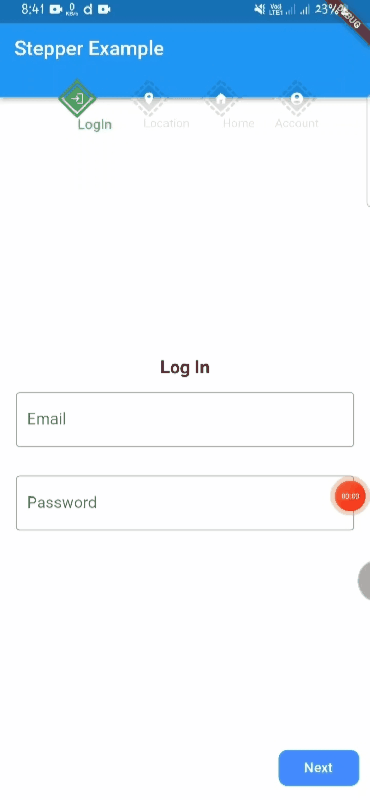
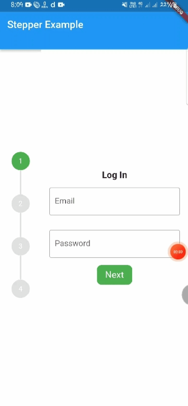
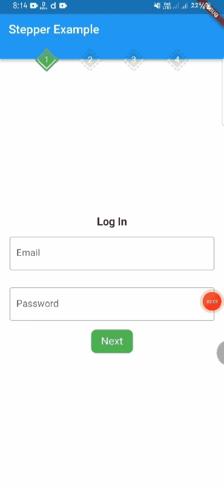
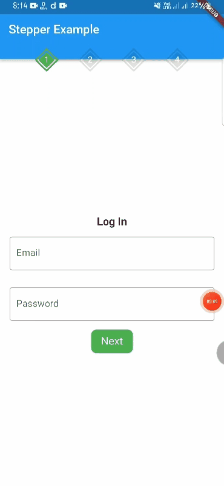
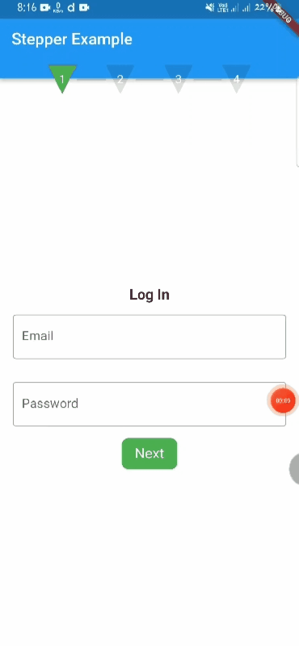
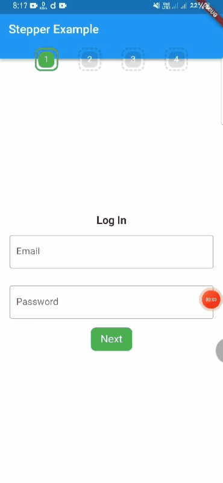
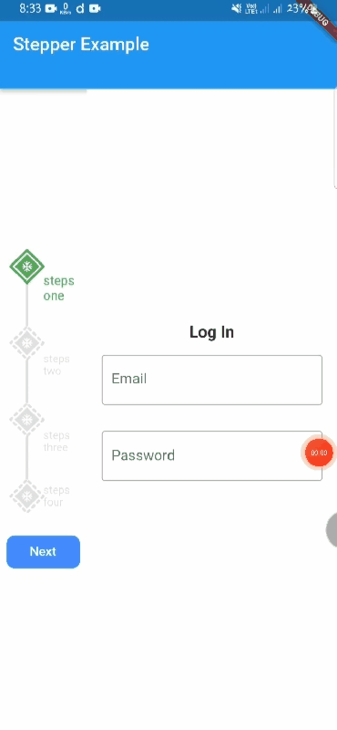
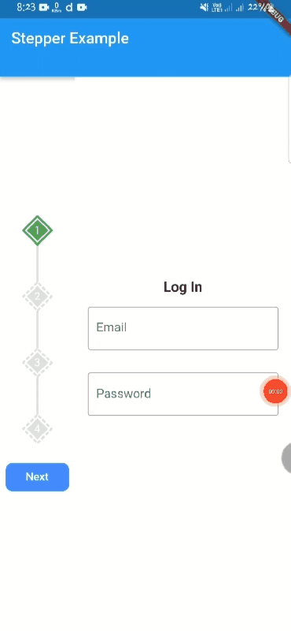
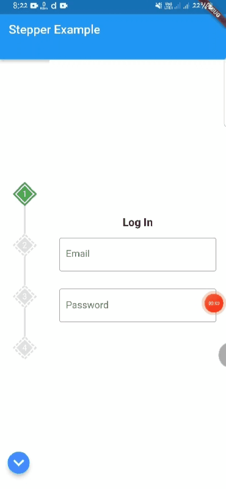

<!--
This README describes the package. If you publish this package to pub.dev,
this README's contents appear on the landing page for your package.

For information about how to write a good package README, see the guide for
[writing package pages](https://dart.dev/guides/libraries/writing-package-pages).

For general information about developing packages, see the Dart guide for
[creating packages](https://dart.dev/guides/libraries/create-library-packages)
and the Flutter guide for
[developing packages and plugins](https://flutter.dev/developing-packages).
-->


##                                   Flutter StepperA

## Key Features

Stepper A can easily build Stepper facility of you any flutter app. 
- Form Validation with FormKey [GlobalKey<FormState>()]
- Support Horizontal and Vertical Stepper
- Customized Stepper step Shape [Rectangle, Circle,Diamond,Triangle]
- Customized Stepper step border [Dash, Straight]
- Customized Stepper line  [Dash, Straight]
- Smooth sliding with Animation
- Easily Customize Step


## package.yaml
```dart
stepper_a: <latest version>
```

## Import
```dart
import 'package:stepper_a/stepper_a.dart';
```
## Simple Example


```dart
StepperA(
    stepperSize: const Size(300,90),
    // stepperSize: const Size(100,350),
    borderShape: BorderShape.diamond,
    borderType: BorderType.straight,
    stepperAxis: Axis.horizontal,
    stepperBackgroundColor: Colors.transparent,
    stepperAController: controller,
    stepHeight: 40,
    stepWidth: 40,
    stepBorder: true,
    floatingButton: false,
    previousButton: StepperAButton(
        width: 90,
        height: 40,
        buttonText: 'Back',
        completeButtonText: ''
    ),
    forwardButton: StepperAButton(
        width: 90,
        height: 40,
        buttonText: 'Next',
        completeButtonText: 'Complete'
    ),
    customSteps: const [
        CustomSteps(
        stepsIcon: Icons.login,
        title: "LogIn"),
        CustomSteps(
        stepsIcon: Icons.location_on,
        title: "Location"),
        CustomSteps(
        stepsIcon: Icons.home,
        title: "Home"),
        CustomSteps(
        stepsIcon: Icons.account_circle,
        title: "Account"),
    
    ],
    step: const StepA(
        currentStepColor: Colors.green,
        completeStepColor: Colors.indigo,
        inactiveStepColor: Colors.black12,
        margin: EdgeInsets.all(5)
    ),
    stepperBodyWidget: [
        StepOne(controller: controller),
        StepTwo(controller: controller,),
        StepThree(controller: controller,),
        StepFour(controller: controller,),
    ]
)
```

## ScreenShot

## FormKey validation


## Custom Steps


## vertical stepper















## Support
If this package was useful to you, helped you to easily deliver your app, saved you a lot of time, or you just want to
support the project, I would be grateful if you give us a rating.
